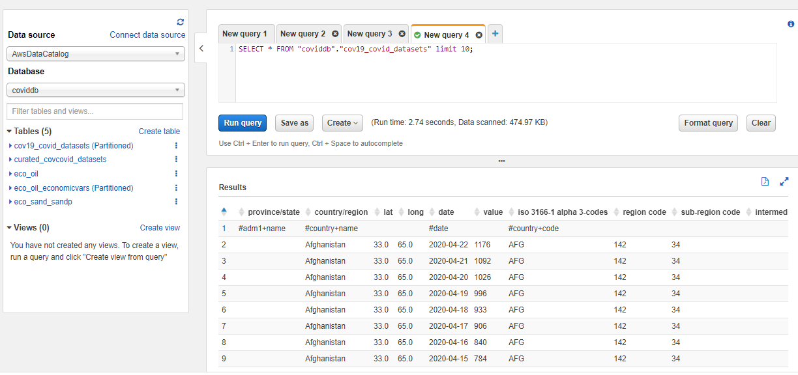
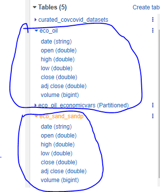
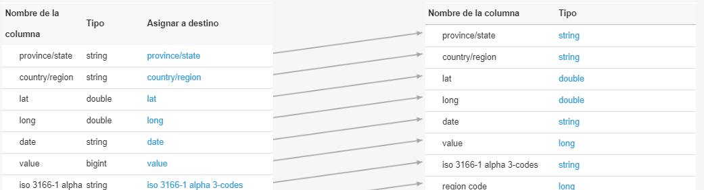
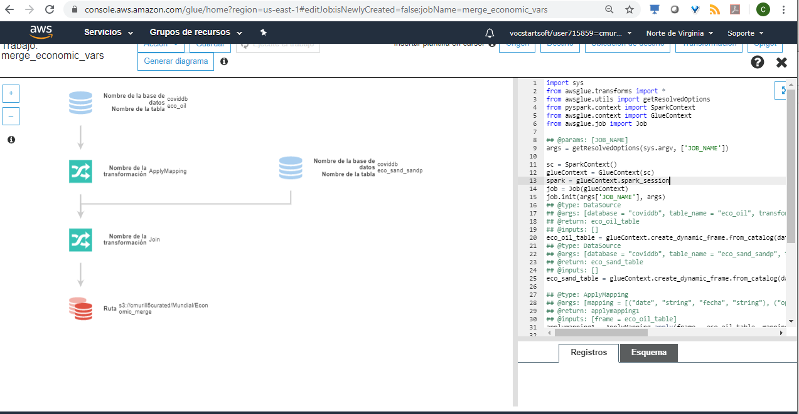
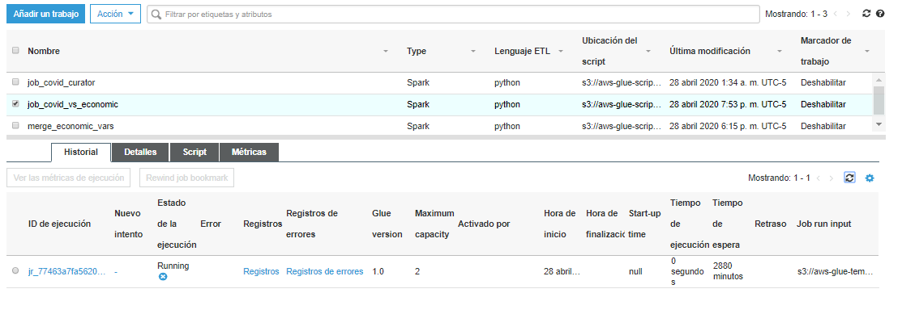
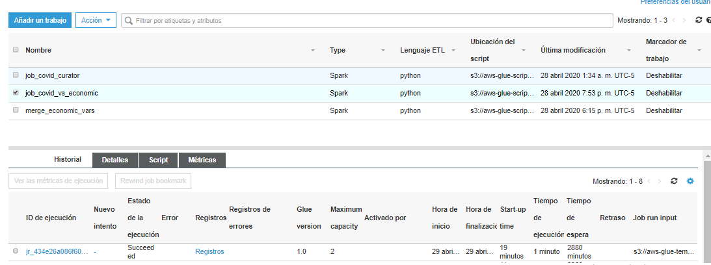
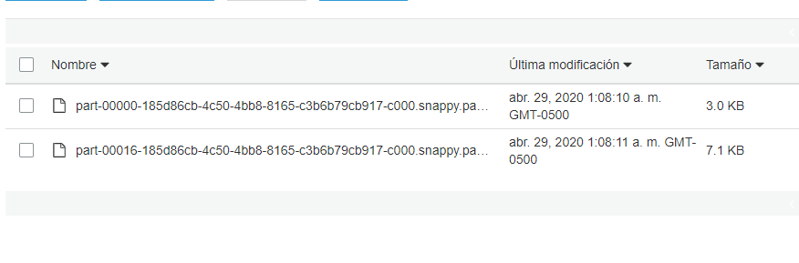

#ESTRUCTURA DE ARCHIVOS EN S3

##SISTEMA DE ARCHIVOS
La estructura propuesta para el amacenamiento de archivos será la siguiente:
```
/
|-- `cmurill5raw`
|	|-- `global`
|	|	|-- `Covid19`
|	|	|	|-- COVID_DATASETS
|	|	|	|-- OTHER_SOURCE
|	|	|	|-- NON_STRUCTURED_DATA
|	|	|--`Economicvars`
|	|	|	|-- ECONOMIC_INDEXES
|	|	|--`Enviroment_variables`
|	|	|	|-- WHEATHER_DATASETS
|	|--`local`
|	|	|-- `Covid19`
|	|	|	|-- COVID_DATASETS
|	|	|	|-- OTHER_SOURCE
|	|	|	|-- NON_STRUCTURED_DATA
|	|	|--`Economicvars`
|	|	|	|-- TRM
|	|	|--`Enviroment_variables`
|	|	|	|-- rain
|	|	|	|-- wind
|	|	|	|-- air quality
|-- cmurill5curated
|	|-- `global`
|	|	|-- `Covid19`
|	|	|	|-- COVID_DATASETS'
|	|	|	|-- OTHER_SOURCE'
|	|	|	|-- NON_STRUCTURED_DATA'
|	|	|--`Economicvars`
|	|	|	|-- ECONOMIC_INDEXES'
|	|	|--`Enviroment_variables`
|	|	|	|-- WHEATHER_DATASETS'
|	|--`local`
|	|	|-- `Covid19`
|	|	|	|-- COVID_DATASETS'
|	|	|	|-- OTHER_SOURCE'
|	|	|	|-- NON_STRUCTURED_DATA'
|	|	|--`Economicvars`
|	|	|	|-- TRM'
|	|	|--`Enviroment_variables`
|	|	|	|-- rain'
|	|	|	|-- wind'
|	|	|	|-- air quality'
|-- cmurill5production
|	|-- `global`
|	|	|-- `CovidvsEconomic`
|	|	|	|-- NON_STRUCTURED_DATA
|	|	|--`Covidvsenviroment`
|	|	|	|-- ECONOMIC_INDEXES
|	|--`local`
|	|	|--`CovidvsEconomic`
|	|	|	|-- NON_STRUCTURED_DATA
|	|	|--`Covidvsenviroment`
|	|	|	|-- TRM

```
## CREACIÓN DE BUCKETS
Se puede realizar desde la interfaz web pero también desde la consola de comandos de la forma:<br>
```
ws s3 mb s3://<nombre_bucket>/<folder>
```

luego para crear la carpeta `cmurill5curated` ejecutamos:
```
aws s3 mb s3://cmurill5curated/ 
```
Estas operaciones tambien las podemos ejecutar desde la interfaz web

## ELIMINAR DE BUCKETS
Podemos eliminar una carpeta de la siguiente manera
```
aws s3 rb s3://cmurill5curated/ --force 
```

## SUBIR ARCHIVO POR COMANDOS
para subir un archivo 
```
aws s3 cp <archivo_local> s3://bucket//
aws s3 sync <archivo_local> s3://bucket// 
```

por ejemplo para subir varios archivos que estan en la carpeta Nueva Carpeta utilizamos
```
aws s3 sync "Nueva carpeta\." s3://cmurillo5raw/global/Economicvars
```
Al actualizar con el comando sync los cambios locales se ven reflejados en el bucket si renombramos un archivo local y volvemos a ejecutar el comando se actualizaria el nombre del archivo en el bucket.

### Subir archivos filtrando por nombre
```
aws s3 sync . s3://cmurillo5raw/local/Covid19/weather/air --include "estacion_data_calidadaire*"
```
## LIBRERIA BOTO3
Tambien se pueden subir recursos a un bucket utilizando una libreria de Python llamada boto3
adjuntada en el archivo uploads3.py

# CATALOGO DE ARCHIVOS USANDO S3
se crean varios crawlers (rastreadores) entre ellos
#### Covid_curator
Crawler que se encarga de las tablas de datasets de COVID y genera una tabla con los datos particionados que contienen la información 
de recuperados muertos y fallecidos:



####  Eco_oil_table y SANDP_crawl
Este rastreador se encarga de generar tablas de variables económicas de comprotamiento del petróleo y de Standard and Pull en tablas separadas.
Se realiza de esta manera porque serán insumo para un rastreador que las llevara de la zona raw a producción


#### covid_curated

Rastreador que genera una tabla de datos que toma como insumo los datos de covid agrupados en la zona *curated*


# JOBS

Los trabajos en su mayoría fueron realizados en `AWS Glue` se mostrarán tres tipos de trabajos en las siguientes secciones:
- Trabajo por interfaz gráfica
- Trabajo Python Spark utilizando librerías de AWS Glue
- Trabajo Python Spark scripp propietario

## Trabajo por interfaz gráfica
El trabajo `job_covid_curator` que se menciona en la sección anterior, toma los datos de zona raw y los lleva a zona curated
cambiando algunos nombres de columnas y filtrando o eliminando otras:


## Trabajo Python Spark utilizando Glue
El trabajo `merge_economic_vars` permite tomar las variables econmicas y aplicarles una operación de fusionar tablas para crear una 
única tabla en la zona curated. Este script se puede observar en detalle en `glue_merge_tables_automatic_script.py`



## Trabajo Python Spark utilizando script propio
El trabajo `job_covid_vs_economic` toma datos de tablas de covid ya creadas y las cruza con la información de variables economicas preparada en pasos 
anteriores que permite que se puedan ver en producción se puede observar el código en `glue_merge_rename_df_manual_script.py`



Una vez finalizado podemos observar los resultados en:



# Publicar resultados en producción
Al final el crawler que se ejecuta crea un archivo parquet en la zona de producción

